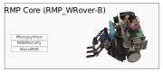

<table style="background-color:#FEFEF2;width:100%">
<tr style="border:1px solid">
  <td style="width:90%;padding-left:10px;font-size:48pt;color:black;float:left">
    
ROSMicroPy

  </td>
  <td>
    
 </td>
 </tr>
 </table>
 

 

At its core ROSMicroPy is an integration of Micropython and MicroROS providing full access to ROS environment, features include;

* Economical entry level Robotics.
* An easier learning curve into ROS
* Expandable beyond the basic configuration into the full ROS environment and its Modules. 
* Distributed processing

## Getting Started
* #### [Install ROSMicroPy on an ESP32 device](./docs/getting-started/flash-code-on-device/installl-on-esp32.md)
* #### [Basic ROS Message passing Example](docs/getting-started/basic-ros-example/basic-example.md)
* #### [Build a ROS based Robot with Joystick Controller](./docs/getting-started/first-robot/FirstROSRobot.md)

## Technical implememtation
* #### [Learn more about the core SDK](docs/rosmicropy-sdk/README.md)

* #### [Learn more about MicroROS Type support](docs/implementation/typeSupport.md)

### Current Build Profiles supported by ROSMicroPy

The core stack provides the basic functionality of a ROS enabled Micropython node  

From it's core configuration, there are other ROSMicroPy modules that can be configured to provide additional functionality. 

The **LCD Controller** introduces to new modules;

***ROSMicroPy-GUI***, is a [JSON Forms](https://jsonforms.io/) renderer for LVGL that allows for a Web based GUI layout designer to produce a JSON description of a screen layout that can be saved on a ROSMicroPy device.

***ROSMiicroPy-JoyCon***, is a Bluetooth HID Central Server, that makes the inputs of a JoyCon device available for the ROSMicroPy environment. 

***ROSMicroPy-CAM*** module allows an ESP32 Cam to publish a video stream in ROS format that can be received by another ROSMicroPy or other ROS enabled device. As images are pulled from the Camera, they are passed to the Python layer to be sent out as a ROS message or allow it to be analyzed by an image processing library such as [YOLO](https://www.kdnuggets.com/2018/09/object-detection-image-classification-yolo.html)
