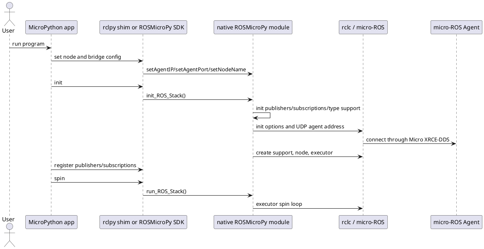

# Startup And Bridge Configuration

ROSMicroPy must know how to reach the micro-ROS agent before the ROS stack is initialized.

## rclpy-Style Configuration

The rclpy shim supports configuration through `rclpy.init(...)`:

```python
rclpy.init(
    bridge_address="192.16.0.50",
    agent_port="8888",
    node_name="minimal_publisher",
    namespace="",
    domain_id=0,
)
```

`bridge_address` is an alias for `agent_ip`.

The examples centralize this in `python_example_code/rclpy/config.py`.

## SDK Configuration

The direct SDK uses setters:

```python
setNodeName("Turtle1")
setAgentIP("192.16.0.50")
setAgentPort("8888")
setDomainID(0)
```

Call these before `init_ROS_Stack()`.

## Native Defaults

If Python code does not set values, native startup applies defaults in `init_ROS_Stack()`:

- Node name: `turtle2`
- Agent IP: `192.168.8.100`
- Agent port: `8888`

The rclpy shim overrides the agent IP with its own default, currently `192.16.0.50`, before calling native initialization.

## Startup Sequence


