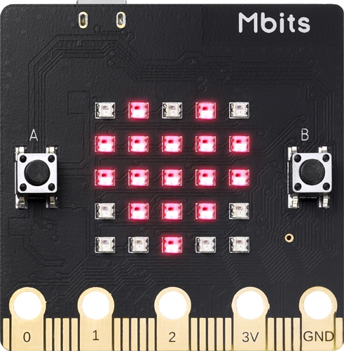
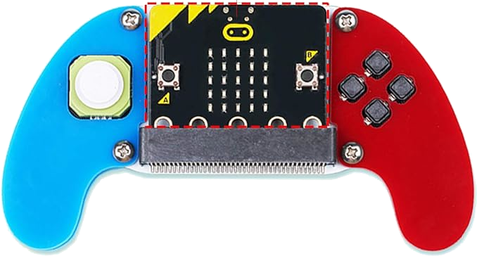
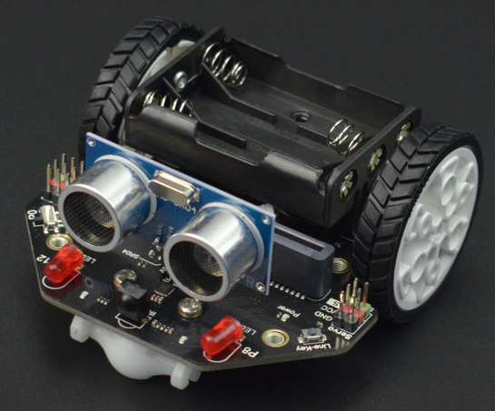
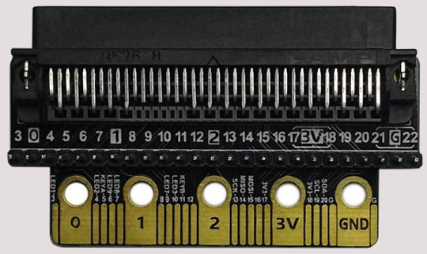

# ROS based Turtlebot robot and Controller
### Price ~$85 / assembly time ~30 min

 

# Parts required
<table>
 <tr>
    <td>Product name</td>
    <td>Unit price</td>
    <td>Qty</td>
    <td>Total</td>
</tr>
<tr>
 <td>Joystick:Bit V2</td>
 <td>$15</td>
 <td>1</td>
 <td>$15</td>
</tr>
<tr>
 <td>Maqueen:Lite</td>
 <td>$35</td>
 <td>1</td>
 <td>$35</td>
</tr>
<tr>
 <td>MBits Dev Board</td>
 <td>$15</td>
 <td>2</td>
 <td>$30</td>
</tr>
<tr>
 <td>Micro:bit extension/breakout board</td>
 <td>$5</td>
 <td>1</td>
 <td>$5</td>
</tr>
<tr>
 <td>Total Cost</td>
 <td></td>
 <td></td>
 <td>$85</td>
</tr>
</table>

 

<table>
<tr>
 <td></td>
 <td>

[Mbits Dev Board - Aliexpress](https://www.aliexpress.com/i/3256803353734572.html?gatewayAdapt=4itemAdapthttps://www.aliexpress.com/i/3256803353734572.html?gatewayAdapt=4itemAdapt)

[MBits Dev Board - Robot Shop](https://www.robotshop.com/products/elecrow-mbits-esp32-dev-board-based-on-letscode-scratch-30-arduino?_gl=1*jfu755*_up*MQ..&gclid=Cj0KCQjww5u2BhDeARIsALBuLnO_Nch8SEz-prvV_2d9JB95J2uQw52U9PiZcb56HbEaT-LIeoOtcCAaAp8fEALw_wcB)

</td>
</tr>
<tr>
 <td></td>
 <td>

[Joystick:Bit V2 - RobotShop](https://www.robotshop.com/products/joystickbit-2-kitremote-controller-microbit-w-acrylic-handle?gad_source=1&gclid=Cj0KCQjww5u2BhDeARIsALBuLnO_Nch8SEz-prvV_2d9JB95J2uQw52U9PiZcb56HbEaT-LIeoOtcCAaAp8fEALw_wcB)

</td>
</tr>
<tr>
 <td></td>
 <td>

[Maqueen:lite TurtleBot](https://www.dfrobot.com/product-1783.html)
</td>
</tr>

<tr>
 <td></td>
 <td>

[Breakout Board - Elecrow](https://www.elecrow.com/micro-bi-gpio-expansion-board.html)

[Breakout Board - 4tronix](https://shop.4tronix.co.uk/products/bit-zero)
</td>
</tr>

</table>
