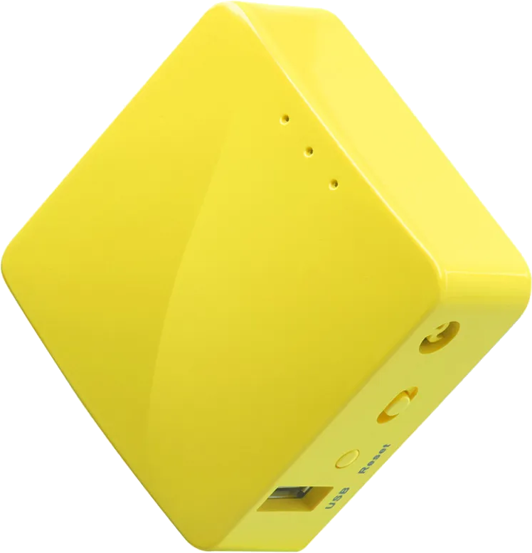
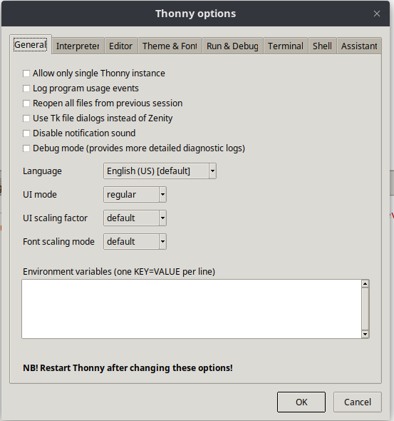
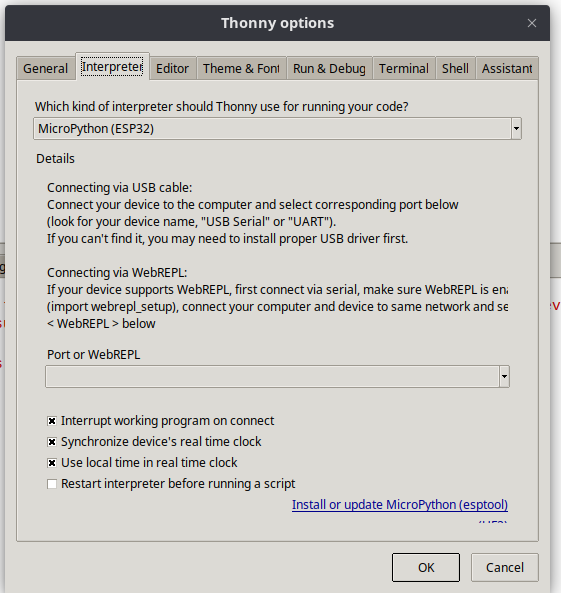
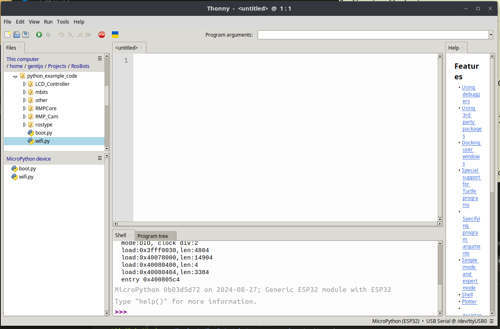
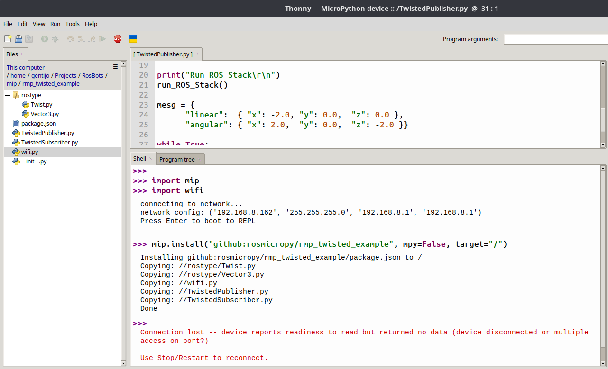
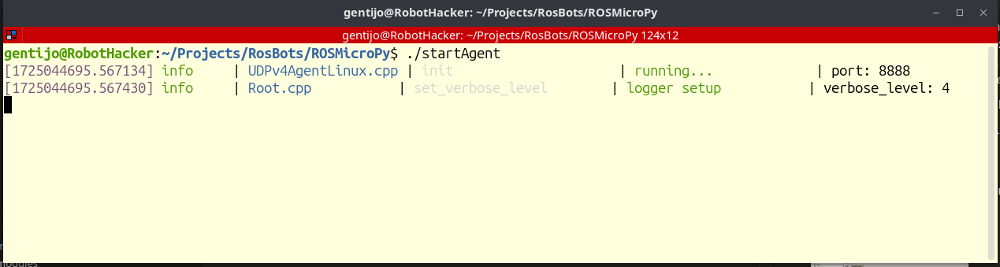
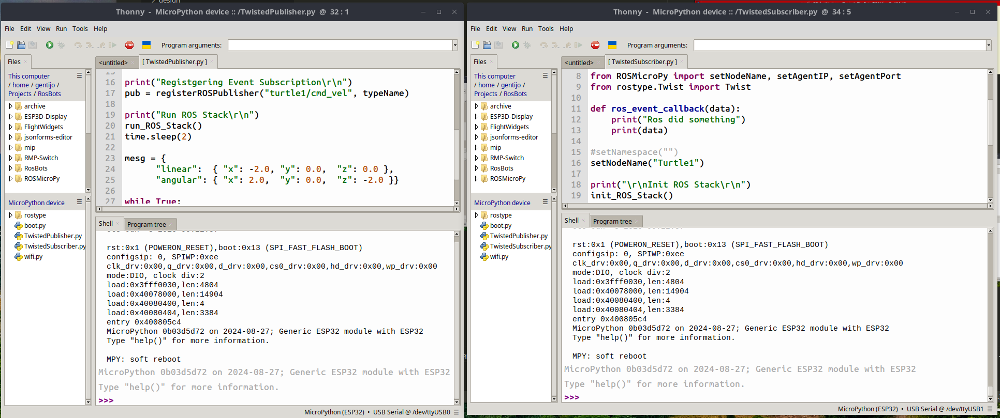
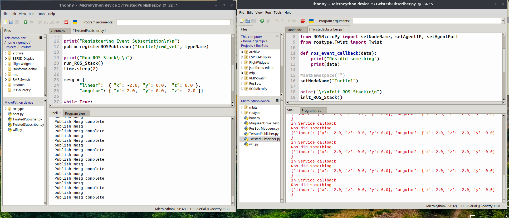
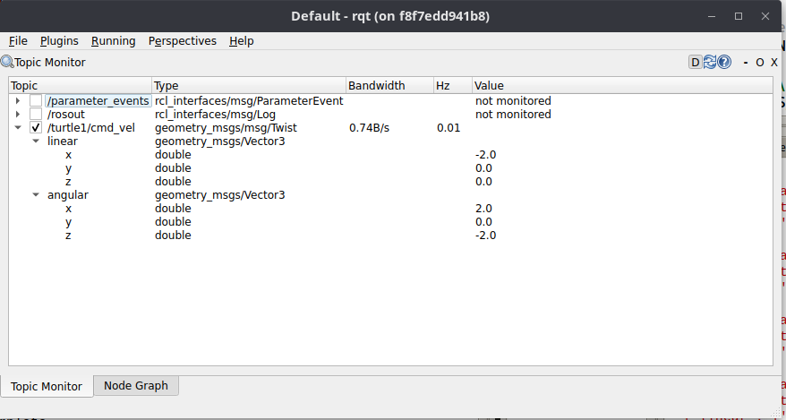
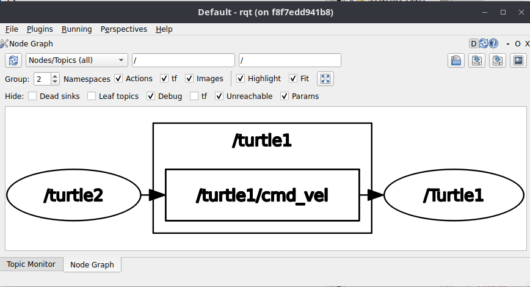

# ROSMicroBy - Basic Example

### For this exercise you will need;

* Two ESP32 devices with ROSMicroPy loaded on both.  Follow these instructions to [load code on a device ](../flash-code-on-device/installl-on-esp32.md)

* A PC that is running Docker that can run the MicroROS Agent container. 

* A common network for the ESP32 Devices and laptop to connect to. A separate router may be helpful here to maintain a consistent configuration and access controls.  A good portable router could be the  [Mango-mt300 available here](https://www.amazon.com/GL-iNET-GL-MT300N-V2-Repeater-300Mbps-Performance/dp/B073TSK26W) 

* Thonny - Python IDE Installed

Launch Thonny and verify the following settings.

Allow multiple instances by unchecking **Allow only a single instance**

Configure the interpreter type Micropython(ESP32) and select the serial port that a device is connected too.  For both devices, you will need to launch two copies and two different ports.

 
 

Once you are connect to Thonny, you should see the REPL prompt in the bottom pane, repeat this process for both devices. 

Once Thonny is connected to the device you see a REPL prompt, follow these steps.

* In the top left hand pane of Thonny, navigate to the directory where you cloned the repo then select the **python_example_code** directory. Within that directory there should be a file named wifi.py, right click that file and select **upload to /**  Wifi.py should appear in the bottom left pane after that. 

* Edit the wifi.py, the one in the bottom left pane,  to add your credentials. 

* in the pane with with the REPL prompt type the following commands
    * **import wifi** `
    * **import mip**
    * **mip.install("github:rosmicropy/rmp_twisted_example", mpy=False, target="/")**

**Repete this process with the 2nd ESP32 device, it could be helpful to connect only one device for this process to avoid confusion on which device is Thony working with**

On the PC, change direectory to the project root, and enter the command
**./startAgent**

With both ESP32 devices connected to the PC, 
* Open Thonny by right clicking the program icon and select "Edit with Thonny"
* Set the Serial Port and verify the REPL prompt is displayed. 
* Repeat the action of "Edit with Thonny" which should bring up another instance of the Thonny program. 
* Change the Port so that Thonny connects to the second device. 

In one instance of Thonny, double click the TwistedPublisher.py to load the code into the Editor, then in the other instance load TwistedSubscriber.py

Click the run button on the instance that has the TwistedPublisher loaded. you should see the node connect to the Agent and start publishing messages. 

Next click the run button of the instance that has TwistedSubscriber loaded. Now you should see the conversation occurring between 

The communications can be verified using RQT Topic Monitor and Node Graph

## **Trouble Shooting tips:**

* You get an aport message when starting the ROS Stack
    * This is because the Device can not see the Agent running. Check network connections verify that the device and the PC are on the same subnet and verify the Agent is running.

