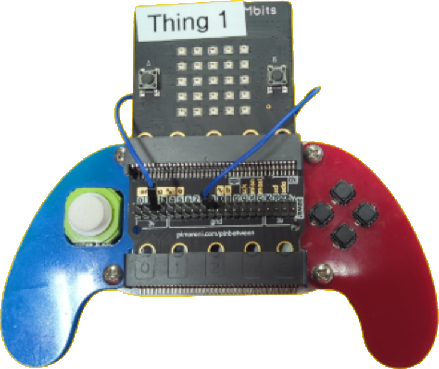

<table style="background-color:#FEFEF2;width:100%">
<tr style="border:1px solid">
  <td style="width:90%;padding-left:10px;font-size:48pt;color:black;float:left">
    
ROSMicroPy

  </td>
  <td>
    
 </td>
 </tr>
 </table>
 

 

 

## Build an entry level ROS Robot with ROSMicroPy

### For this project we will be using these [parts](./FirstROSRobot-BOM.md)

### Initialize the ROSMicroPy boards
  * Follow the steps here to 
[initialize an ESP 32 Device with ROSMicroPy](../flash-code-on-device/installl-on-esp32.md)

#### Note: it is helpful to only having one board connected to the PC at a time to assure you are not loading code on the wrong device

### Assembly of the Robot Base.
* Insert on of the ESP32 Devices (MBits board) in the Micro:Bit slot on the Maqueen:lite body. 
* Verify that the Wifi.py script is loaded on the device, see [Directions Here](../basic-ros-example/basic-example.md)
* At the REPL prompt, type in the following commands
  * import Wifi 
  * import mip
  * mip.install("github:rosmicropy/rmp_maqueen_base", mpy=False, target="/")

This will load the scripts, in source code form, into the ESP32 device. 

Load the python script, RosBot_Maqueen.py, into the editor and run it

You can test just the robot by running the TeleopKey simulator that comes with ROS2.  

### To run the simulator
* Open a new terminal window and change directory to the Project Directory.
* Enter the command **./startTeleopKey**, this will launch a Docker container with the ROS Development environment installed, then run the Teleop program allowing you to use the PC + Keyboard to command the robot.

### To attach the Joystick Controller:
* Attach the extension connector to the Micro:Bit connector on the Joystick.
* using a Jumper wire, connect pins 2 and 9
* insert the MBits controller board to the Micro:bit connector on the extension board

* Attach the Mbits board to the computer and launch a second instance ot Thonny. 

* If it does not exist on the device already, upload the Wifi.py from python_example_code director to the device.

* In thonny's REPL prompt type in the following commands
  * import wifi
  * import mip
  * mip.install("github:rosmicropy/rmp_joystickBit_V2", mpy=False, target="/")

* load the script RosBot_Teleop.py into the editor and run it.

#### Note: the jumper needs to be in place because the ADC that is assigned to the Joystick switch is disabled when QSPI ram is enabled. The Jumper reroutes that signal to another ADC pin.

### Enable the Bot/Controller to auto run the respective scripts. 
* Edit wifi.py on each device and edit the last line in the file to import the respective script.  

#### Note: the select.select statement is looking for any key press that would cause the import statement to be ignored and jump directly to the REPL prompt. 

# Congratulations, you now have a ROS based robot and Joystick Controller

