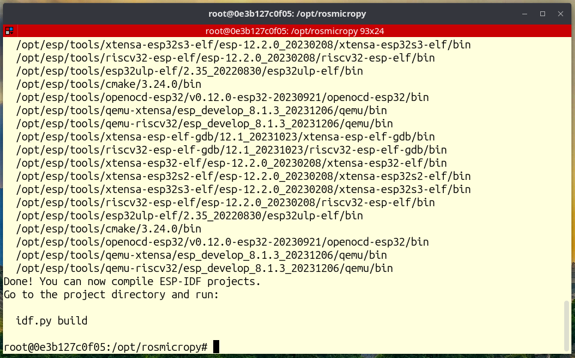
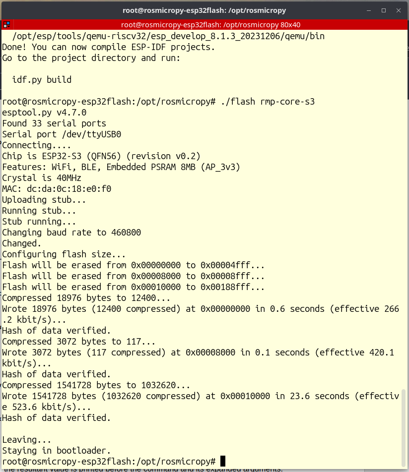
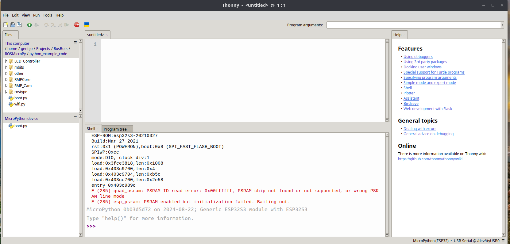

<div style="width:100%">
<table style="background-color:#FEFEF2;width:100%">
<tr style="border:1px solid">
  <td style="width:90%;padding-left:10px;font-size:48pt;color:black;float:left">
    <p style="float:left;">ROSMicroPy</p>
  </td>
  <td>
    </span>
 </td>
 </tr>
 </table>
 </div>
<br/>
<hr/>
<br/>

## Overview
This guide provides step-by-step instructions on how to install ROSMicroPy on an ESP32 device. This procedure is compatible with Linux and macOS. Windows users may need adjustments for WSL2.

## Prerequisites
- **Operating System**: Linux or macOS (procedures may vary for Windows with WSL2).
- **Tools Installed**: Docker, [Thonny Python IDE](https://thonny.org/).

## Supported Devices
- **ESP32 Generic (WROVER)**
- **ESP32-S3 (WROOM1)**

## Installation Steps

### 1. Clone the ROSMicroPy Repository
Begin by cloning the ROSMicroPy repository from GitHub:

```
git clone https://github.com/ROSMicroPy/ROSMicroPy
* Change directory to the root of the project 
* run ./startESP32Flash
```
On success you should see the following screen

</img>

At the command prompt type

**./flash [DEVICE_ID]**

Replace **[DEVICE_ID]** with one of the following

* **rmp-core**      -> (rmp-core code for a generic ESP32 device)
* **rmp-core-s3**   -> (rmp-core code for an ESP32-S3 device)
* **rmp-espcam**    -> (rmp-core + espcam code for and ESP32-S device)
* **rmp-espcam-S3** -> (rmp-core + espcam code for an ESP32-S3 'wroom1' device)
* **rmp-rosco-phd** -> (rosco-phd = ROS2 Control and Observibility programmable handheld device) 

## On success you should see the following screen

</img>

## Post Install
* Close the terminal window.
* On the host computer, launce Thonny and verify that the REPL prompt is present. 



## Your device is now ready to be a ROS Node


