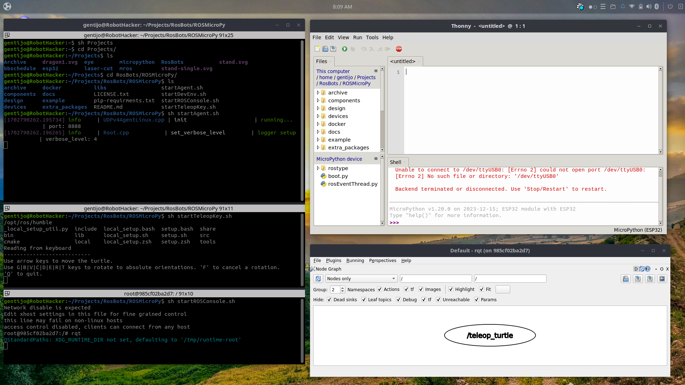
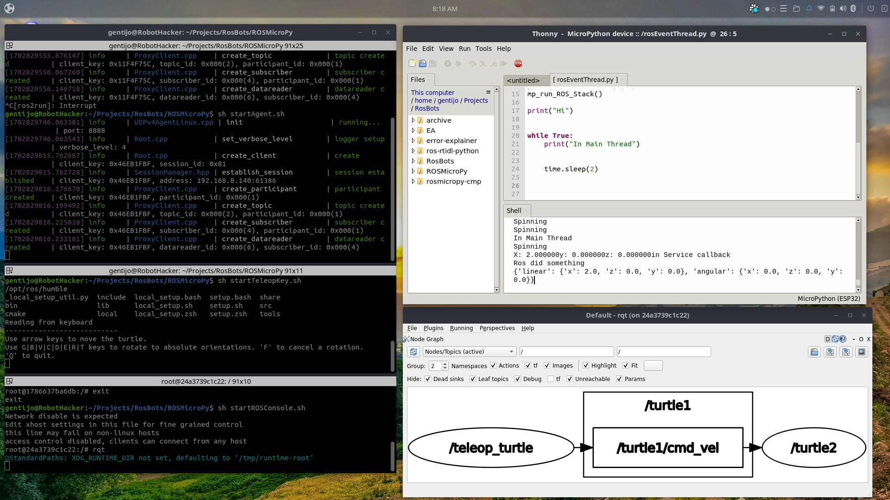

# Firmware Development Environment

### Prerequisites  
- Build and run the [Agent Container](../containerSupport/containerROSAgent.md)

- Build and run the [TeleopKey Container](../containerSupport/containerTeleopKey.md)

- Install and run [Thonny](https://thonny.org/)

### Optional Components
- Build and run the [ROS Console Container](../containerSupport/containerROSConsole.md)

- From the ROS Console, run the [**rqt**](https://wiki.ros.org/rqt) GUI App

### Suggested Screen layout
- Arrange terminals running the required containers, arrange them as a stacked array on the left hand side of the screen. A terminal program that supports splitting the window horizontally, makes window management easier

- Open the Thonny and arrange it on the top right of the screen

- Move the  **rqt** bottom bottom right hand of the screen.

- Visual Code Studio can be loaded on another Desktop allowing you to switch from the compiler for the firmware, to the configuration to perform Python development.

- Sample Python code is located in the [example directory](../../example)

- The sample code can be loaded on the device by dragging it from the top (Local Directory) down to the device directory.
  
- To start the ROS System and register to receive /cmd_vel messages with the data type of geometry_twist 

