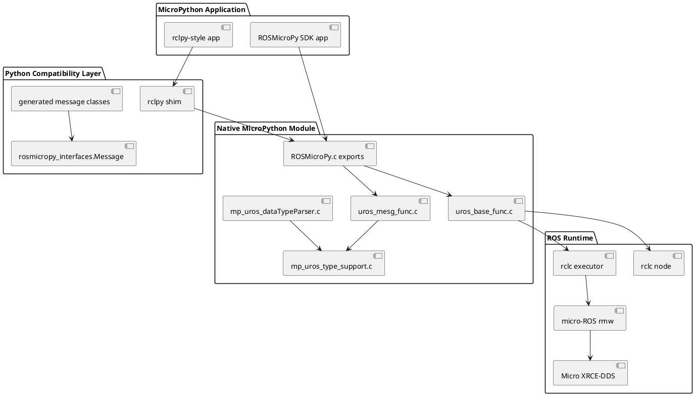
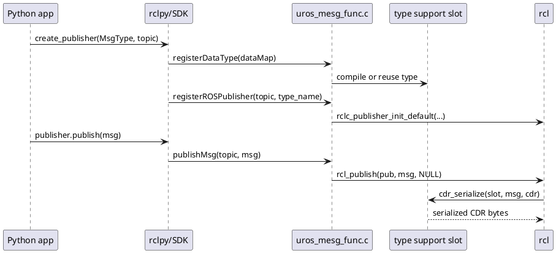
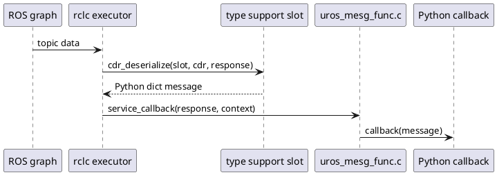

# Technical Architecture

ROSMicroPy is layered so Python application code can use ROS concepts while native code owns the micro-ROS and rclc integration.

## Runtime Layers

## Native API Exports

`components/native/ROSMicroPy.c` exposes the native functions into MicroPython. The important public functions are:

- `init_ROS_Stack()`
- `run_ROS_Stack()`
- `setDomainID(...)`
- `setNamespace(...)`
- `setNodeName(...)`
- `setAgentIP(...)`
- `setAgentPort(...)`
- `registerDataType(...)`
- `dumpDataType(...)`
- `registerROSPublisher(...)`
- `registerEventSubscription(...)`
- `publishMsg(...)`

## Initialization

`init_ROS_Stack()` performs the native setup:

- Initializes subscription slots.
- Initializes publisher slots.
- Initializes dynamic type-support slots.
- Applies native defaults for node name, agent IP, and port if Python did not configure them.
- Creates `rcl_init_options_t`.
- Sets the micro-ROS UDP agent address.
- Creates rclc support, node, and executor.
- Sets executor timeout.

`run_ROS_Stack()` starts the ROS spin loop. It repeatedly enters the MicroPython GIL, spins the rclc executor, exits the GIL, and delays.

## Publisher Flow

## Subscription Flow

## Slot Tables

The current implementation uses fixed-size tables:

- Type-support slots: 20
- Publisher slots: 10
- Subscription slots: 10

This keeps the embedded runtime simple, but it means applications should register only the types, publishers, and subscriptions they need.
