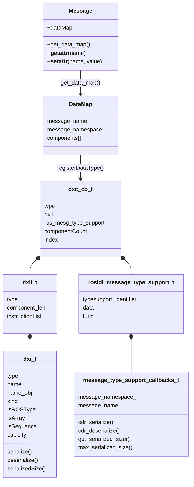
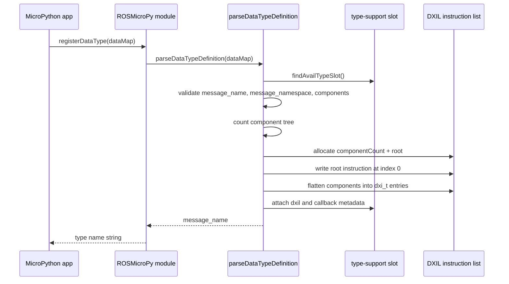
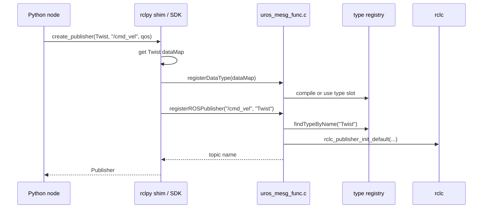
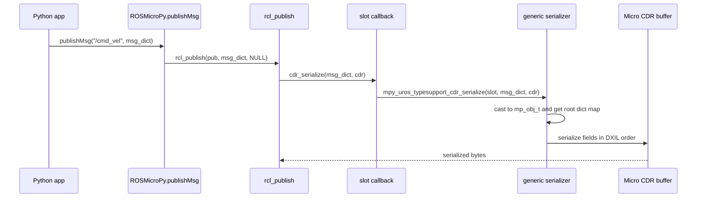
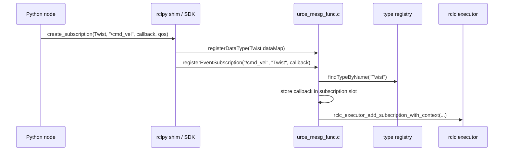
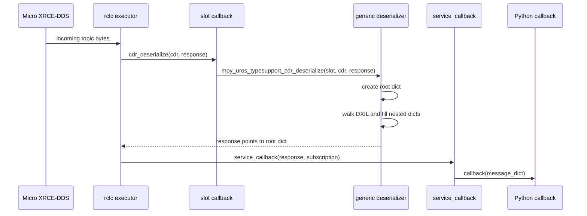
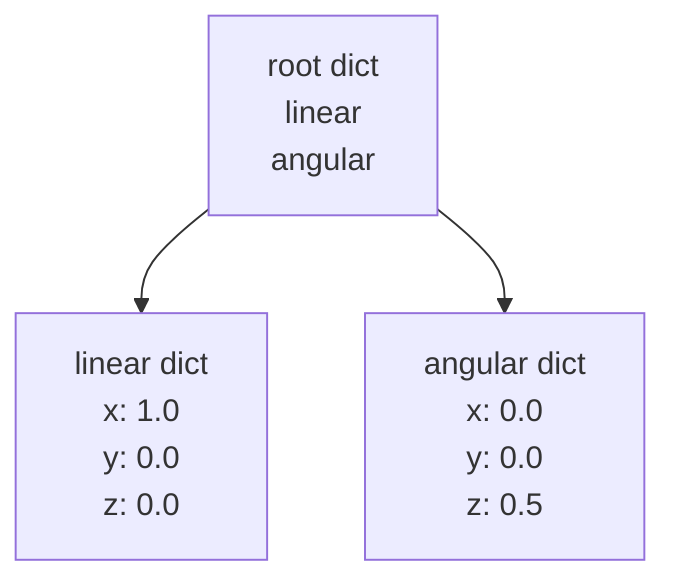

# Type Support And Serialization

This document explains the runtime type-support path used by ROSMicroPy. It is the deepest part of the technical track: generated or hand-written MicroPython message definitions become `dataMap` dictionaries, `dataMap` dictionaries are compiled into a compact instruction list, and micro-ROS calls slot-specific C callbacks to serialize and deserialize messages with Micro CDR.

The diagrams are written as fenced `mermaid` blocks, which GitHub renders directly in Markdown files.

## The Problem ROSMicroPy Solves

Normal ROS 2 C nodes compile message-specific type-support code ahead of time. ROSMicroPy instead accepts message definitions at runtime from MicroPython. The native module has to make micro-ROS believe it has normal `rosidl_message_type_support_t` handles while still using a generic serializer/deserializer that reads MicroPython dictionaries.

ROSMicroPy does this with three concepts:

- A Python `dataMap` describes a ROS message type and its fields.
- A native DXIL instruction list flattens the message definition into ordered transfer instructions.
- A fixed type-support slot owns a `rosidl_message_type_support_t` whose callbacks delegate back to the generic serializer/deserializer with that slot number.

## Important Files

- `components/libROSMicroPy/py/rosmicropy_interfaces.py`: base `Message` class and helpers that build `dataMap` dictionaries from generated `_TYPE_DEF` tuples.
- `components/libROSMicroPy/mp_uros_type_support/mp_uros_dataTypeParser.c`: parses `dataMap` dictionaries and compiles DXIL.
- `components/libROSMicroPy/mp_uros_type_support/mp_uros_dataTypeParser.h`: defines `dxi_t`, `dxil_t`, and `dxc_cb_t`.
- `components/libROSMicroPy/mp_uros_type_support/mp_uros_type_support.c`: owns type-support slots and implements CDR serialization, deserialization, and serialized-size callbacks.
- `components/libROSMicroPy/mp_uros_modules/uros_mesg_func.c`: registers publishers and subscriptions and passes dynamic type-support handles to rclc.

## Runtime Model



`dxc_cb_t` is the runtime control block for a registered type. It binds the compiled schema (`dxil`) to the type-support handle that rclc and micro-ROS consume.

## Type Definitions In MicroPython

Generated message classes inherit from the dictionary-backed `Message` helper. A generated class normally exposes `_TYPE_NAME`, `_TYPE_DEF`, and `_fields_and_field_types`. The helper converts `_TYPE_DEF` into a `dataMap`:

```python
{
    "message_name": "Twist",
    "message_namespace": "geometry_msgs::msg",
    "components": [
        {
            "name": "linear",
            "type": "Vector3",
            "components": [
                {"name": "x", "type": "float64"},
                {"name": "y", "type": "float64"},
                {"name": "z", "type": "float64"},
            ],
        },
        {
            "name": "angular",
            "type": "Vector3",
            "components": [
                {"name": "x", "type": "float64"},
                {"name": "y", "type": "float64"},
                {"name": "z", "type": "float64"},
            ],
        },
    ],
}
```

The direct SDK can pass this map explicitly:

```python
from ROSMicroPy import registerDataType
from geometry_msgs.msg import Twist

type_name = registerDataType(Twist.get_data_map())
```

The rclpy-style layer does the same thing automatically when `Node.create_publisher()` or `Node.create_subscription()` receives a message class.

## dataMap Schema

The top-level map uses these fields:

- `message_name`: ROS message name, such as `Twist`.
- `message_namespace`: ROS namespace used by the callbacks, such as `geometry_msgs::msg`.
- `components`: ordered list of fields.

Each component uses these fields:

- `name`: field name.
- `type`: ROS scalar type name or nested ROS type name.
- `components`: optional child fields for nested ROS types.
- `isArray`: optional boolean for fixed-length arrays.
- `isSequence`: optional boolean for variable-length sequences.
- `capicity`: optional capacity value. The spelling is currently `capicity` in the runtime schema and generated helpers, so docs and examples use that spelling intentionally.

Supported scalar kinds are mapped in `populateSerDeEntries()`:

| ROS field type | DXIL kind |
| --- | --- |
| `bool` | `DXI_KIND_BOOL` |
| `byte` | `DXI_KIND_BYTE` |
| `char` | `DXI_KIND_CHAR` |
| `int8`, `uint8` | `DXI_KIND_INT8`, `DXI_KIND_UINT8` |
| `int16`, `uint16` | `DXI_KIND_INT16`, `DXI_KIND_UINT16` |
| `int32`, `uint32` | `DXI_KIND_INT32`, `DXI_KIND_UINT32` |
| `int64`, `uint64` | `DXI_KIND_INT64`, `DXI_KIND_UINT64` |
| `float32` | `DXI_KIND_FLOAT32` |
| `float64`, `double` | `DXI_KIND_FLOAT64` |
| `string` | `DXI_KIND_STRING` |
| anything else with `components` | `DXI_KIND_ROS_TYPE` |

Arrays and sequences are supported for scalar and string fields. Arrays or sequences of nested ROS types currently raise an error during type registration.

## Compiling dataMap To DXIL

`registerDataType(dataMap)` calls `parseDataTypeDefinition(dataMap, true)`. The parser performs two passes over the component tree.

First, it walks the tree in count-only mode so it knows how many `dxi_t` instructions to allocate. Then it allocates a `dxil_t`, creates a root instruction at index `0`, and walks the tree again to populate each instruction.



The flattened list preserves ROS field order. Nested message fields become a parent `DXI_KIND_ROS_TYPE` instruction followed by child scalar instructions. The last instruction in a nested block is marked with `islastBlk` so the serializer/deserializer can pop back to the parent object.

For `geometry_msgs/msg/Twist`, the instruction list has this shape:

| Index | Field | Kind | Stack effect |
| --- | --- | --- | --- |
| `0` | `Root` | ROS type | root dictionary placeholder |
| `1` | `linear` | ROS type | push `msg["linear"]` |
| `2` | `x` | float64 | serialize/deserialize scalar |
| `3` | `y` | float64 | serialize/deserialize scalar |
| `4` | `z` | float64 | serialize/deserialize scalar, then pop |
| `5` | `angular` | ROS type | push `msg["angular"]` |
| `6` | `x` | float64 | serialize/deserialize scalar |
| `7` | `y` | float64 | serialize/deserialize scalar |
| `8` | `z` | float64 | serialize/deserialize scalar, then pop |

## Type-Support Slots

`init_mpy_ROS_TypeSupport()` creates 20 type-support slots. Each slot owns:

- a `dxc_cb_t` control block,
- a `rosidl_message_type_support_t`,
- a `message_type_support_callbacks_t`,
- slot-specific callback wrappers such as `mpy_uros_ts3_serialize()`.

The slot-specific wrappers are important because the micro-ROS type-support callback signature does not include user data. ROSMicroPy generates one wrapper set per slot; each wrapper calls the generic implementation with its baked-in slot number:

```c
bool mpy_uros_ts3_serialize(const void *msg, ucdrBuffer *cdr)
{
    return mpy_uros_typesupport_cdr_serialize(3, msg, cdr);
}
```

That slot number lets the generic serializer find the right `dxc_cb_t`, `dxil_t`, and field instructions.

## Publisher Registration

Publisher registration links a topic to a previously registered dynamic type:



`registerROSPublisher()` stores the topic name, marks a publisher slot in use, saves the type control block, and passes `type_CtrlBlk->ros_mesg_type_support` to `rclc_publisher_init_default()`.

## Marshaling From MicroPython To C

When Python publishes a message, the object remains a MicroPython object. `publishMsg(topic, data)` looks up the registered publisher and calls:

```c
rcl_publish(&pub->pub, data, NULL);
```

The `data` pointer is the MicroPython dictionary-backed message object. Later, the micro-ROS type-support layer calls the slot's CDR serializer. ROSMicroPy casts the untyped message pointer back to `mp_obj_t` and reads it as a dict.



The serializer uses an object stack to track nesting. The root dictionary is pushed first. When a `DXI_KIND_ROS_TYPE` instruction is encountered, the serializer looks up that field in the current dict, validates that it is another dict, and pushes it. Scalar instructions read from the current dict and call the instruction's serializer function.

Missing fields raise `KeyError`. Fields with the wrong MicroPython type raise `TypeError` or `ValueError`.

## Scalar Serialization

Scalar field serializers delegate to `serialize_one_scalar()`, which calls the matching Micro CDR function:

| DXIL kind | Micro CDR serializer |
| --- | --- |
| `DXI_KIND_BOOL` | `ucdr_serialize_bool()` |
| `DXI_KIND_UINT8` | `ucdr_serialize_uint8_t()` |
| `DXI_KIND_INT16` | `ucdr_serialize_int16_t()` |
| `DXI_KIND_INT32` | `ucdr_serialize_int32_t()` |
| `DXI_KIND_INT64` | `ucdr_serialize_int64_t()` |
| `DXI_KIND_FLOAT32` | `ucdr_serialize_float()` |
| `DXI_KIND_FLOAT64` | `ucdr_serialize_double()` |
| `DXI_KIND_STRING` | `ucdr_serialize_string()` |

Integer fields must be MicroPython integers. Floating-point fields accept MicroPython floats or integers. `char` accepts either an integer or a one-character string.

## Arrays, Sequences, And Strings

The runtime distinguishes fixed arrays from variable sequences:

- Fixed arrays require `isArray=True` and a positive `capicity`. The Python value length must exactly match `capicity`.
- Sequences use `isSequence=True`. They serialize a `uint32` length prefix before the items. If `capicity` is positive, the sequence cannot exceed it.
- `byte`, `uint8`, and `int8` sequences can serialize directly from MicroPython buffer objects such as `bytes` or `bytearray`.
- Strings serialize with Micro CDR string encoding. Bounded strings use `capicity`; unbounded strings use a default capacity during max-size estimates and deserialization buffer allocation.

The max-size callback marks `full_bounded=false` when it sees an unbounded sequence or unbounded string.

## Serialized Size Callbacks

micro-ROS asks the type support for serialized sizes. ROSMicroPy implements:

- `mpy_uros_typesupport_get_serialized_size(slot, msg, current_alignment)`: computes the actual size of a concrete MicroPython message.
- `mpy_uros_typesupport_get_initial_serialized_size(slot, msg)`: calls the actual-size function with alignment `0`.
- `mpy_uros_typesupport_get_max_serialized_size(slot, full_bounded, current_alignment)`: estimates the maximum size from DXIL metadata and bounded capacities.

Size calculations include Micro CDR alignment and the four-byte string/sequence length prefixes where required.

## Subscription Registration

Subscriptions follow the same type registration path, then attach a callback to the rclc executor:



`registerEventSubscription()` stores the MicroPython callback both in the subscription slot and in a MicroPython root pointer array so the callback is not collected by the GC.

## Deserialization From micro-ROS To MicroPython

When a ROS message arrives, micro-ROS calls the slot's deserialize callback. ROSMicroPy creates a new root dict, walks the DXIL instruction list, and fills the dict in ROS field order.



For nested ROS types, `deserializeROSType()` creates a child dict, stores it in the current parent under the field name, and pushes that child dict onto the object stack. Scalar instructions deserialize one value from the CDR stream and store it into the current dict. When an instruction is marked `islastBlk`, the stack pops back to the parent dict.

## Example: Twist Message Flow

For this publish call:

```python
msg = {
    "linear": {"x": 1.0, "y": 0.0, "z": 0.0},
    "angular": {"x": 0.0, "y": 0.0, "z": 0.5},
}

publishMsg("/cmd_vel", msg)
```

the serializer walks this shape:



The CDR stream receives the six `float64` values in ROS message-definition order:

```text
linear.x
linear.y
linear.z
angular.x
angular.y
angular.z
```

The nested `Vector3` objects do not serialize as extra containers. They only change which MicroPython dict the scalar field lookups come from.

## Current Limits

- There are 20 dynamic type-support slots.
- Publisher and subscription tables each have 10 slots.
- Nested ROS types are supported as fields.
- Arrays and sequences of nested ROS types are not supported yet.
- The object stack supports up to 5 nested dict levels.
- Unbounded strings and sequences are supported at runtime, but max-size estimates use default capacities.
- `dataMap` field order matters because the DXIL walk determines CDR field order.

## Debugging Type Support

Use `dumpDataType(type_name)` after registration:

```python
type_name = registerDataType(Twist.get_data_map())
dumpDataType(type_name)
```

This prints the registered type name, namespace, component count, and instruction list. It is the fastest way to check whether the runtime understood a message definition the way you expected.

Common issues:

- `missing ROS field`: the published dict does not contain a field required by DXIL.
- `must be a dict`: a nested ROS field such as `linear` was not provided as a dict.
- `array requires capicity`: a fixed array definition omitted `capicity`.
- `array length mismatch`: the Python list length does not match a fixed array capacity.
- `exceeds sequence capacity`: the Python list or byte buffer is longer than the bounded sequence allows.
