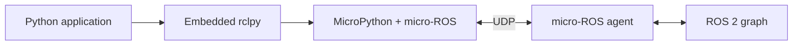

# ROSMicroPy documentation

**Write Python on the device. Exchange messages with ROS 2.**

ROSMicroPy combines MicroPython, micro-ROS, and an embedded `rclpy` compatibility layer on ESP32-class devices. Applications use Python publishers, subscriptions, timers, and topic-backed services; the native runtime handles serialization and communication with a micro-ROS agent.

## Start here

- [Install firmware and run your first node](getting-started.md).
- [Write an application](rclpy-guide.md) using the frozen Python API.
- [Check API support and limits](api-reference.md) before porting a desktop node.
- [Build firmware](building-firmware.md) or explore the [runtime architecture](technical-architecture.md).

## Scope and compatibility

The browser installer includes Core firmware for generic ESP32 and ESP32-S3. Additional board configurations exist in the repository; they are not all included in the installer. See the [firmware target table](building-firmware.md#board-targets).

The embedded API implements a subset of desktop `rclpy`. QoS arguments do not configure native QoS, service calls use paired topics, and runtime resources have fixed limits. A generated message class does not guarantee that every field shape is supported by the serializer.

These pages describe the checked-in implementation. The [release notes](releases.md) provide release context. Material under `old_docs/` is historical; new applications should use this guide and the current `rclpy` examples.

## Project resources

[Source code](https://github.com/ROSMicroPy/ROSMicroPy) ·
[Issue tracker](https://github.com/ROSMicroPy/ROSMicroPy/issues) ·
[License](https://github.com/ROSMicroPy/ROSMicroPy/blob/main/LICENSE.txt)
