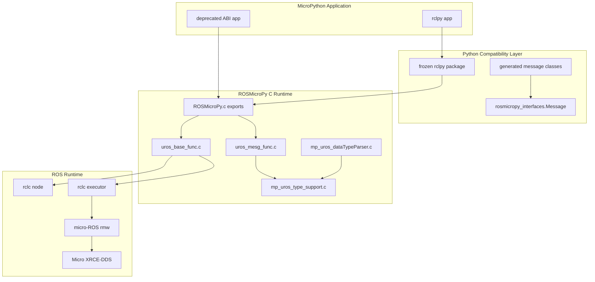
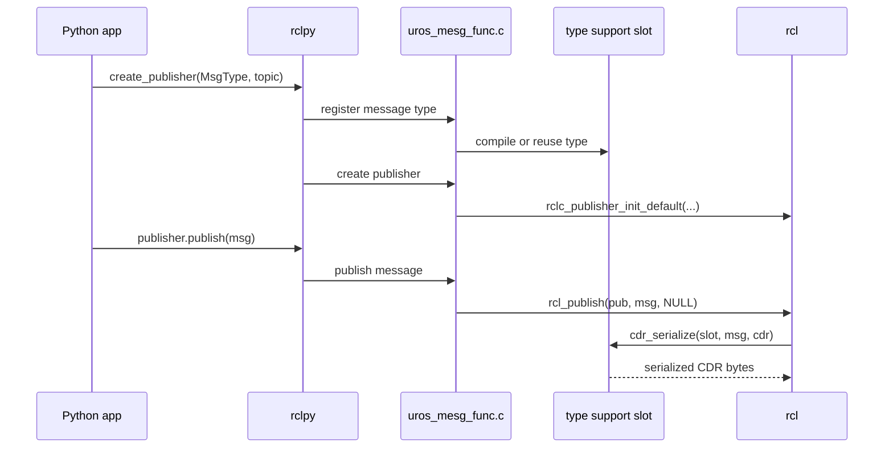
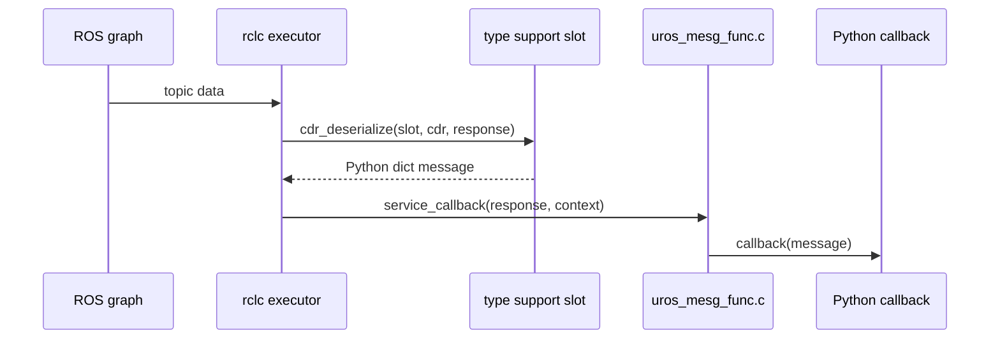
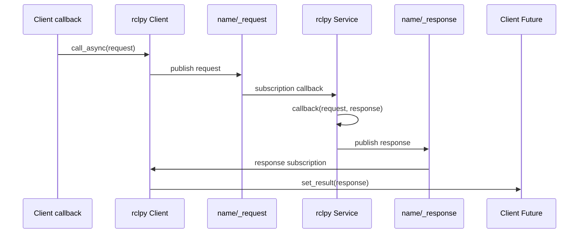

# Technical Architecture

ROSMicroPy is layered so Python application code uses the integrated rclpy interface while the C runtime owns the micro-ROS and rclc integration.

## Runtime Layers

## Deprecated ABI Exports

`components/libROSMicroPy/mp_uros_modules/uros_mp_reg.c` registers the direct `ROSMicroPy` MicroPython functions. That ABI exists to support the integrated rclpy interface and older code; it should be treated as deprecated for application development:

- `init_ROS_Stack()`
- `run_ROS_Stack()`
- `setDomainID(...)`
- `setNamespace(...)`
- `setNodeName(...)`
- `setAgentIP(...)`
- `setAgentPort(...)`
- `registerDataType(...)`
- `dumpDataType(...)`
- `registerROSPublisher(...)`
- `registerEventSubscription(...)`
- `publishMsg(...)`

## Initialization

`init_ROS_Stack()` performs the native setup:

- Initializes subscription slots.
- Initializes publisher slots.
- Initializes dynamic type-support slots.
- Applies native defaults for node name, agent IP, and port if Python did not configure them.
- Creates `rcl_init_options_t`.
- Sets the micro-ROS UDP agent address.
- Creates rclc support, node, and executor.
- Sets executor timeout.

`run_ROS_Stack()` starts the ROS spin loop. It repeatedly enters the MicroPython GIL, spins the rclc executor, exits the GIL, and delays.

## Publisher Flow

## Subscription Flow

## Service Server Mode

The rclpy compatibility layer currently builds services from ordinary publishers and subscriptions. For service name `name`, the client publishes the generated request message on `name/_request`, and the server publishes the generated response message on `name/_response`.

This is an embedded compatibility mechanism, not an rcl/rmw service entity. There is currently no request header, client identifier, or sequence number, so the Python client matches responses to futures in FIFO order. See [Service server mode](server-mode.md) for user-facing constraints.

## Slot Tables

The current implementation uses fixed-size tables:

- Type-support slots: 20
- Publisher slots: 10
- Subscription slots: 10

This keeps the embedded runtime simple, but it means applications should register only the types, publishers, and subscriptions they need. Topic-backed service endpoints use these same publisher and subscription tables.
